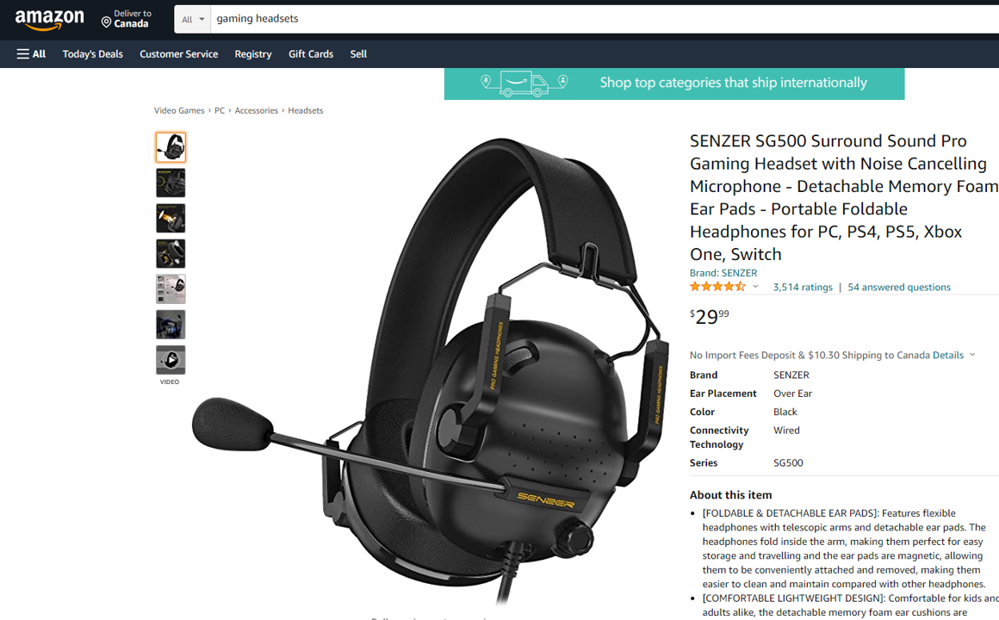
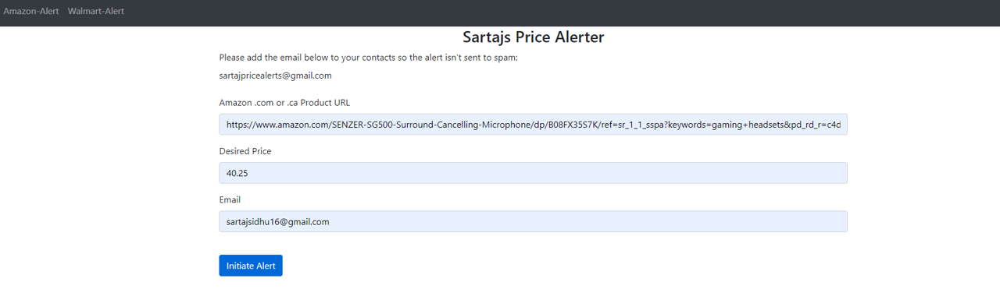
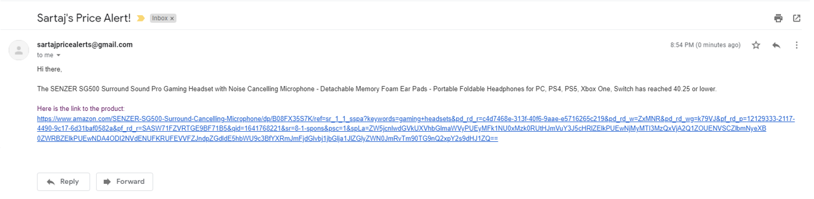

# Price-Alerter

Takes a desired price from a user and emails them once their product has reached that price or lower
compatable with walmart.com and amazon.ca and .com

hosted on heroku
https://sartaj-pricealerts.herokuapp.com/

Amazon product page example

Typing in the info

Since the product is already less than 40.25
Alert email is sent
Email looks like :

